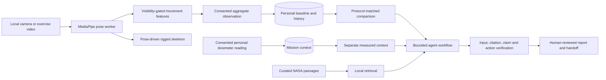

# AstroBone Mission Health Platform: Build Contract

AstroBone is a research decision-support system, not a physiological digital
twin, fracture diagnosis, treatment planner, or NASA-approved flight system.
The 3D skeleton is a visualization retargeted from estimated pose landmarks;
it is not an independently reconstructed body mesh.

## Mission Workflow

The browser can run a deterministic review without a backend. A private
loopback FastAPI service adds SQLite history, local embedding retrieval, and
bounded Llama/Gemma tool planning. The language model selects allowlisted
finding, citation, and action IDs; it does not calculate risk or write clinical
conclusions. Raw video is decoded in the browser and is not saved by AstroBone.

## Data And API

| Record | Required provenance | Storage | Interpretation |
| --- | --- | --- | --- |
| Crew profile | Pseudonymous ID, mission, available equipment | Browser local storage or local SQLite | No identifying health records in this prototype |
| Movement assessment | Mission day, source `camera` or `video`, gravity, protocol, pose model, tracking quality, sample count, finite aggregate metrics | Explicit consent only | Camera and video baselines are not interchangeable |
| Radiation observation | Mission day, cumulative personal absorbed dose in mGy, dosimeter ID, explicit consent | Separate profile-linked series | Manually entered, unverified instrument context; not organ/bone dose or risk fusion |
| Report | Comparison, source IDs, limitations, verification, tool trace | Local browser or SQLite | Human review required |

The private API exposes `POST /api/companion/profiles`,
`GET /api/companion/profiles/{id}`,
`POST /api/companion/profiles/{id}/assessments`,
`POST /api/companion/profiles/{id}/radiation`, and
`POST /api/companion/runs`. See `docs/companion-api.md` for the complete
contract. Executable database tables are in `companion/schema.sql`.

## Evidence And Agent Boundaries

1. A vision worker estimates visible body landmarks. Low visibility, too few
   usable frames, incompatible files, or interrupted playback return an
   insufficient assessment instead of invented measurements.
2. The comparison engine requires the same protocol, observation gravity,
   media source, pose model, and calibration state. It reports within-person
   changes, not a cause or clinical significance.
3. A recorded dosimeter value is displayed with its instrument and day. No
   environmental stress index, bone dose, or multimodal risk score is computed.
4. NASA passages are attributed research context. Local retrieval is from a
   small curated corpus, not a continuously updated literature search or
   comprehensive evidence review.
5. A bounded orchestrator verifies selected IDs, citation provenance,
   equipment-compatible actions, and safety wording. This is not an
   unrestricted multi-agent clinician. Severe reported symptoms bypass the
   model and direct users to an approved human-led escalation protocol.
6. Reports disclose missing baselines, capture limitations, retrieval or model
   fallback, unavailable clinical predictions, and the synthetic demo label.

## What Remains To Build

| Proposed capability | Release gate before it can be claimed |
| --- | --- |
| InstantHMR or another 3D mesh recovery adapter | Verify checkpoint license, exact output format, temporal stability, runtime and privacy; compare reconstructed joints with an independent reference and keep MediaPipe fallback visibly distinct |
| IMU or exercise equipment integration | Calibrate time synchronization, axes, drift, units, data consent, and missing-sensor behavior |
| Radiation-informed musculoskeletal risk | Obtain suitable individual dosimetry, biological or clinical outcomes, confounders, and qualified review; validate an exposure-response model independently |
| Temporal transformer or XGBoost deterioration model | Obtain consented longitudinal labels, subject-disjoint training/test splits, external evaluation, calibration, uncertainty and subgroup analysis |
| Broad scientific RAG and knowledge graph | Ingest licensed sources with immutable versions, population tags, citation spans, contradiction checks and regular expert review |
| Intervention generator | Map only to mission- and clinician-approved protocols, with contraindications, equipment checks and a hard human approval step |
| Flight deployment | Security, authentication, encryption, offline reliability, human factors, medical device/regulatory and mission safety review |

The current FracAtlas X-rays and OSDR-804 mouse microCT cannot train or
validate astronaut longitudinal deterioration. A visually plausible 3D
animation is not proof of anatomical accuracy. The application must not show
an invented 91% medical confidence or injury probability.

## Demonstration And Evaluation

For a Space Apps demonstration, show a local exercise video on the left and
the pose-driven skeleton on the right, then save aggregate movement evidence
with a pseudonymous profile. The scripted Day 1 to Day 180 example is
explicitly **synthetic**. Show a protocol-matched trend, optional measured
dosimeter context, NASA citations, and the verifier's limitations before
exporting a human-reviewed handoff. If no human pose is tracked, demonstrate
the insufficient-data refusal instead of a fabricated success.

Measure success in layers: pose failure rate and latency; joint-angle error
against reference motion capture or goniometry; repeated-capture agreement;
baseline comparison reproducibility; citation correctness; false reassurance
and escalation errors; and user comprehension in an approved usability study.
Do not claim astronaut health effectiveness until prospective external
evaluation supports it.

Primary context: [NASA bone changes](https://www.nasa.gov/reference/risk-of-spaceflight-induced-bone-changes/),
[NASA individual radiation monitoring](https://www.nasa.gov/reference/6-0-natural-and-induced-environments-vol-2/),
and the [InstantHMR code repository](https://github.com/mohamdev/InstantHMR).
