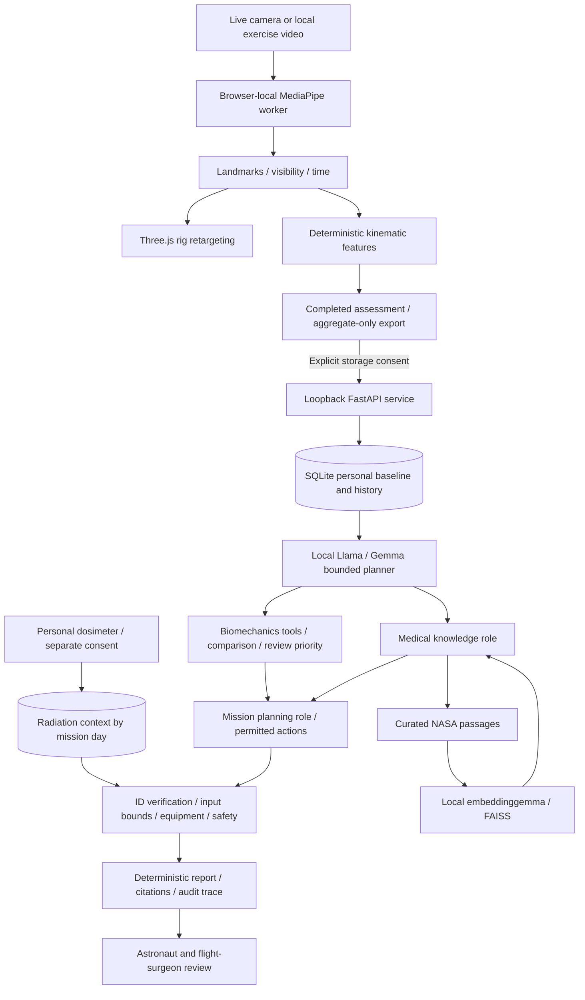
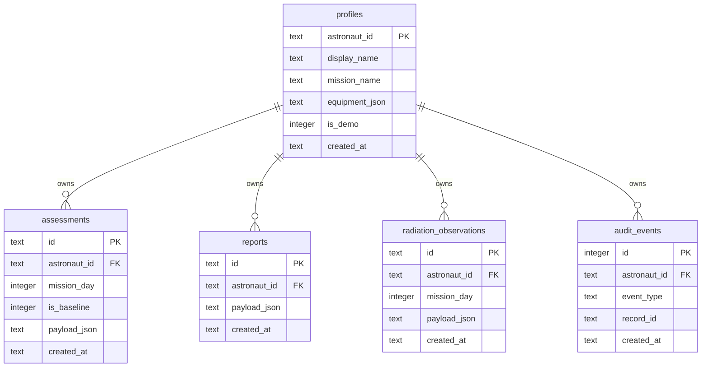

# Local Musculoskeletal Companion, Version 1

AstroBone connects a private pose-linked skeleton to a personal observation
history and a local evidence-review workflow. It is research decision support,
not a diagnosis, autonomous treatment system, or mission-certified product.

## System Architecture

## Software Boundaries

| Component | Implementation | Responsibility |
| --- | --- | --- |
| Camera/video and rig | Existing MediaPipe worker, `skeletalRetargeter.js`, Three.js | Kinematic visualization; local video stays in the browser and is not mesh recovery |
| Feature engine | `functionalAssessment.js` | Joint range, angular speed, bilateral differences, image-plane shoulder alignment and normalized sway |
| Aggregate adapter | `companionEvidence.js` | Strict finite metrics; excludes frames and raw landmarks |
| Workspace | `companionPanel.js`, `companion.css` | Profiles, timeline, review trace, sources, export |
| Service | `companion/app.py`, `schema.py` | Loopback API, validation, job status, origin restrictions |
| Digital history | `store.py`, `schema.sql` | Locked baseline, mission days, camera/video protocol lineage, consented dosimeter context |
| Analysis | `analysis.py` | Within-person deltas and bounded review priority |
| Orchestration | `agents.py` | Shared local model with specialized roles, dependency-enforced tools and verification |
| Local model | `local_model.py` | Ollama structured JSON, allowlisted local models, no cloud fallback |
| Retrieval | `retrieval.py`, `knowledge.json` | Six curated NASA passages, local vectors, source IDs, corpus hash |

The role names describe one bounded orchestrator, not three independent expert
clinicians. There is no unrestricted shell, browser, prescribing tool, or
LLM-controlled database write.

## Database Schema

The executable schema is `companion/schema.sql`.

Assessments preserve protocol, gravity, source, pose model, calibration state,
sample count and tracking quality. A unique partial index permits one locked
baseline per profile. Demo profiles cannot contain real observations, or vice
versa. Live-camera and uploaded-video baselines are not interchangeable.
Dosimeter readings require separate consent and remain context, not risk inputs.
Deleting a profile cascades to its observations, reports and audit entries.

## AI Pipeline And Verification

1. Read consented aggregate observations for the selected profile.
2. Ask local Llama/Gemma for a schema-constrained tool plan.
3. Resolve dependencies before execution, regardless of model ordering.
4. Compare only like-for-like protocol, gravity, source, pose model and distance
   calibration. Low-quality or insufficient captures withhold comparisons.
5. Compute `(current - baseline) / baseline * 100`. A zero baseline produces no
   relative percentage. Changes are observations, not causal explanations.
6. Retrieve curated evidence using local embeddings and FAISS. If unavailable,
   clearly label lexical retrieval. This is not a comprehensive literature review.
7. Generate only permitted, equipment-compatible review actions.
8. Let the LLM select existing finding, citation and action IDs. Reject unknown
   or duplicated IDs. Allow one repair attempt, then use deterministic output.
9. Render computed text, not free-form medical prose. Always show all numerical
   findings. General NASA evidence is not proof of a personal change's cause.
10. Save report provenance, model digest, corpus hash, warnings and tool trace.

Reported red flags bypass the LLM and trigger human review; the user should not
wait for model inference. The physics gate checks input plausibility only. It
explicitly does NOT approve exercise safety or infer force and bone strength.

## Measurement And Capability Limits

| Available now | Not established or not implemented |
| --- | --- |
| MediaPipe-driven rig and aggregate camera/video metrics | InstantHMR checkpoint validation, IMU ingestion, exact motion capture |
| Personal baseline and history | Patient-specific finite-element twin or medical ground truth |
| Joint range and kinematic asymmetry | Bone density, muscle strength, bone stress from video |
| Relative image-plane sway | Validated balance impairment score |
| Strict calibrated-distance input contract | Automatic calibrated gait speed or step length from camera |
| Local Llama planning and local evidence retrieval | Outcome-trained astronaut deterioration or injury predictor |
| Consented personal dosimeter context | Validated radiation-to-bone risk model or inferred bone dose |
| Fixed human-review actions | Prescribing exercise frequency, dose or treatment |
| Loopback desktop service | On-device Android LLM, multi-user production security |

Do not train a longitudinal deterioration predictor on fracture X-rays or mouse
microCT and label it an astronaut model. Those data answer different questions.
Before any clinical claim, acquire consented protocol-matched longitudinal data,
independent reference measurements, outcome labels, subject-level splits,
external validation, calibration and subgroup/uncertainty evaluation.

## Privacy And Deployment

Initial software/model downloads require internet. Review inference uses only
loopback HTTP with proxy use disabled; research links open externally only on a
user click. The curated corpus does not fetch documents during review. Raw video
remains in the local browser media pipeline, outside this service.

SQLite is NOT encrypted. This version has no user authentication, at-rest key
management or tamper-evident audit. Use pseudonyms and synthetic research cases,
not identifiable operational crew records. Keep ports 8010 and 11434 on loopback.
Other local processes and an authorized same-origin app remain in the trust
boundary. A container/cloud migration requires authentication, authorization,
TLS, secret management, retention policy and security review first.

The launcher stores observations in `E:\AstroBoneRuntime\data`; direct service
startup defaults to `%LOCALAPPDATA%\AstroBone\companion`. Keep these locations
outside OneDrive and other sync software. A local API cannot prevent an
independently configured backup/sync agent from copying files. Exported reports
also remain subject to the user's chosen download/sync location.

## Primary References

- [NASA: Risk of Spaceflight-Induced Bone Changes](https://www.nasa.gov/reference/risk-of-spaceflight-induced-bone-changes/)
- [NASA: The Human Body in Space](https://www.nasa.gov/humans-in-space/the-human-body-in-space/)
- [NASA: Human Performance](https://www.nasa.gov/reference/4-0-human-performance/)
- [Ollama structured outputs](https://docs.ollama.com/capabilities/structured-outputs)
- [Ollama chat API](https://docs.ollama.com/api/chat)
- [Ollama embedding API](https://docs.ollama.com/api/embed)
- [Ollama Windows runtime](https://docs.ollama.com/windows)

The corpus contains attributed paraphrases, not full republished NASA documents.
Review each source and population before extending its use.
